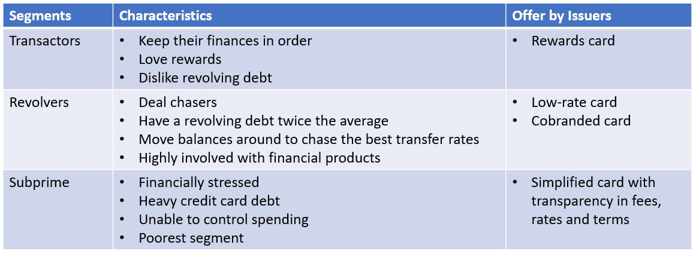
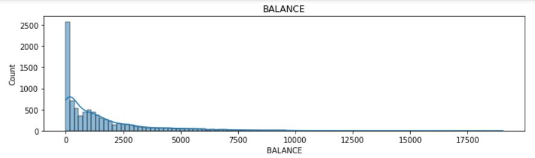
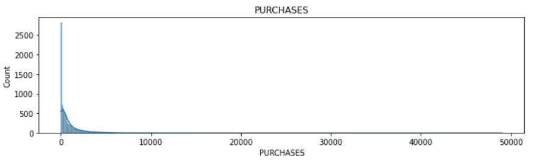
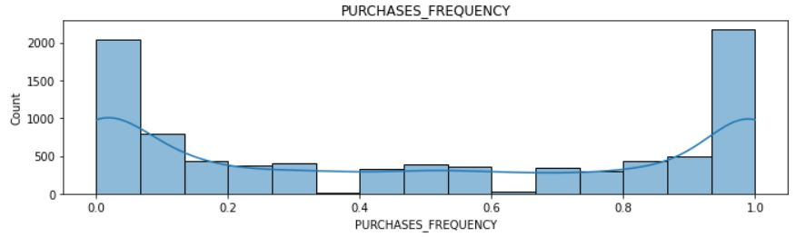

# Credit Card Customers Segmentation

## About The Project

### Goals

* Develop a customer segmentation to define strategy for credit card marketing campaign through K-Means clustering
* Divide customers into at least 3 distinctive groups

### Background

* One of the key pain points for marketers is to know their customers and identify their needs
* By understanding the customers, marketers can launch a tagreted marketing campaign that is tailored for specific needs 
* 

### Built With

* Python, Pandas, Numpy, Seaborn, Matplotlib, Sklean
* K-Means Clustering
* Jupyter Notebook

### Dataset

* [Source:Kaggle Credit Card Dataset](https://www.kaggle.com/arjunbhasin2013/ccdata)
* The sample Dataset summarizes the usage behavior of about 9000 active credit card holders during the last 6 months
* The file is at a customer level with 18 behavioral variables.

## Procedures

1. Import Python libraries and dataset
2. Data cleaning 
3. Data visualization and exploration
4. Use K-means to group observations with similar attribute values

## Findings (full charts and tables can be found in Jupyter notebook)
1. Statistical summary (full table in Jupyter notebook)
   
2. Distribution of each attribute value (more plots in Jupyter notebook)
   
   
   

### Raw Data Explanation
* CUSTID : Identification of Credit Card holder (Categorical)
* BALANCE : Balance amount left in their account to make purchases
* BALANCEFREQUENCY : How frequently the Balance is updated, score between 0 and 1 (1 = frequently updated, 0 = not frequently updated)
* PURCHASES : Amount of purchases made from account
* ONEOFFPURCHASES : Maximum purchase amount done in one-go
* INSTALLMENTSPURCHASES : Amount of purchase done in installment
* CASHADVANCE : Cash in advance given by the user
* PURCHASESFREQUENCY : How frequently the Purchases are being made, score between 0 and 1 (1 = frequently purchased, 0 = not frequently purchased)
* ONEOFFPURCHASESFREQUENCY : How frequently Purchases are happening in one-go (1 = frequently purchased, 0 = not frequently purchased)
* PURCHASESINSTALLMENTSFREQUENCY : How frequently purchases in installments are being done (1 = frequently done, 0 = not frequently done)
* CASHADVANCEFREQUENCY : How frequently the cash in advance being paid
* CASHADVANCETRX : Number of Transactions made with "Cash in Advanced"
* PURCHASESTRX : Numbe of purchase transactions made
* CREDITLIMIT : Limit of Credit Card for user
* PAYMENTS : Amount of Payment done by user
* MINIMUM_PAYMENTS : Minimum amount of payments made by user
* PRCFULLPAYMENT : Percent of full payment paid by user
* TENURE : Tenure of credit card service for user

## References
* [Market Segmentation from Wikipedia](https://en.wikipedia.org/wiki/Market_segmentation)
* [New frontiers in credit card segmentation: Tapping unmet consumer needs](https://www.mckinsey.com/~/media/mckinsey/dotcom/client_service/Financial%20Services/Latest%20thinking/Payments/MoP19_New%20frontiers%20in%20credit%20card%20segmentation.ashx) 
* [AI meets marketing segmentation models](https://towardsdatascience.com/data-science-powered-segmentation-models-ae89f9bd405f)
* [SuperDataScience Team Udemy Courses](https://www.udemy.com/user/superdatascience-team/?utm_medium=email&utm_source=getresponse&utm_content=50%25+Off+%2B+Black+Friday+Bonuses&utm_campaign=) 

